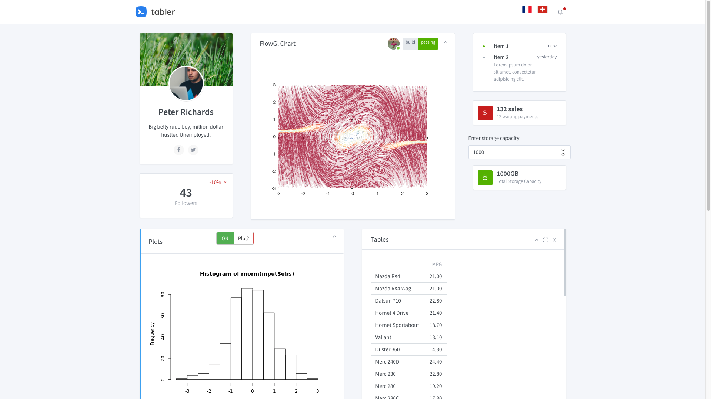

# tablerDash

[](https://travis-ci.org/RinteRface/tablerDash)
[](https://cran.r-project.org/package=tablerDash)

> Tabler dashboard template for shiny with Bootstrap 4

See [https://tabler.io](https://tabler.io) for the original template.

## Installation

This package is not on CRAN:

```r
# latest devel version
devtools::install_github("RinteRface/tablerDash")
```

## Demo

### shiny server
A current demo running on shiny server open source is available [here](http://www.rinterface.com/shiny/tablerDash/)

<br>

<div class="row">
<div class="card">
<a href="http://www.rinterface.com/shiny/tablerDash/" target="_blank"></a>
</div>
</div>

<br>

### shinyapps.io, shiny-server pro and RStudio Connect
tablerDash works on all the professional RStudio products:
- [on shinyapps.io](https://dgranjon.shinyapps.io/tablerDashDemo/)
- [on RStudio Connect](http://130.60.24.205:3939/tablerDashDemo/)

### Other Examples

<div class="row">
<div class="card">
<a href="https://community.rstudio.com/t/shiny-contest-submission-gotta-catch-em-almost-all/25284" target="_blank"></a>
</div>
</div>

<br>

<div class="row">
<div class="card">
<a href="https://community.rstudio.com/t/shiny-contest-submission-gotta-catch-em-almost-all/25284" target="_blank"></a>
</div>
</div>

<br>


## Issues

Issues are listed [here](https://github.com/RinteRface/tablerDash/issues). 
